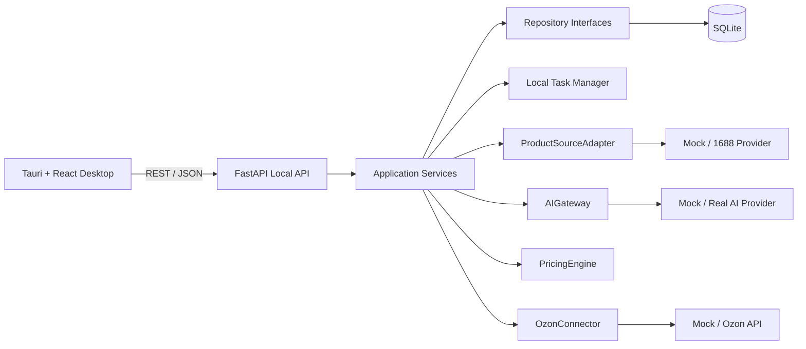
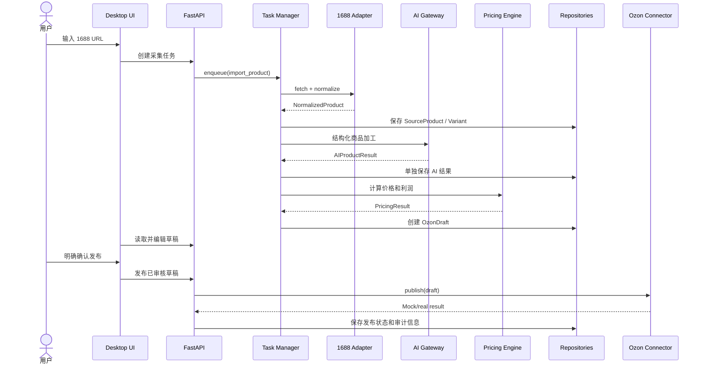

# Ozon Assistant 架构

## 1. 架构目标

Ozon Assistant 采用本地优先、模块化的桌面架构。V1 服务于单个卖家和单个本地用户，优先保证完整链路可运行、可测试、可维护，并为以后切换真实 Provider、迁移 PostgreSQL 和服务端任务队列保留清晰边界。

当前架构不处理 SaaS 多租户、账号注册、订阅计费、完整订单采购、广告投放和无人值守的高风险操作。

## 2. 系统关系

桌面端只通过稳定的本地 API 使用业务能力。HTTP 路由负责验证输入、调用应用服务并返回 Schema，不承载采集、AI、定价或发布规则。

## 3. 模块边界

### Desktop

`apps/desktop` 负责导航、表格、表单、状态展示、主题和交互确认。它不直接访问 SQLite，不保存业务凭证到源码，也不执行价格计算。

### API

`backend/app/api` 在稳定前缀 `/api/v1` 下提供 REST 接口、依赖注入和统一错误响应。Pydantic Schema 是 API 边界；数据库 ORM 对象不直接作为外部响应。

### Application Services

`backend/app/services` 编排用例，例如采集商品、处理 AI、计算价格、创建草稿和发布草稿。Service 依赖抽象接口，保持与 SQLite、具体 LLM、Playwright 和 Ozon HTTP 实现解耦。

### Repositories and Database

`backend/app/repositories` 定义商品、AI 结果、草稿和任务等持久化操作。SQLAlchemy 实现在 `backend/app/database` 中管理会话和事务。业务代码不直接拼写 SQLite SQL，以便后续迁移 PostgreSQL。

数据库结构变化必须通过 Migration 管理；不依赖启动时静默重建用户数据库。

### Integrations

`backend/app/integrations` 隔离外部系统：

- `ProductSourceAdapter` 把来源数据转换为统一 `NormalizedProduct`。
- `Alibaba1688DataProvider` 隔离官方 API、浏览器自动化或第三方数据源。Playwright 只能存在于 Browser Provider 内。
- `AIGateway` 统一模型调用，Provider 输出经过 Pydantic / JSON Schema 验证。
- `OzonConnector` 集中认证、HTTP、重试、限流、错误映射和脱敏日志。

V1 使用 Mock 实现跑通业务链路。替换为真实实现时，不改变上层 Service 的流程接口。

### Pricing

`backend/app/pricing` 使用确定性代码计算成本、最低售价、建议售价、预计利润和利润率。输入包含采购、物流、平台佣金、支付、广告预估、退货损耗、汇率、目标利润率和其他费用。LLM 不负责数学结果。

### Task Manager

`backend/app/tasks` 管理耗时操作，任务状态至少包括 `Pending`、`Running`、`Success`、`Failed` 和 `Cancelled`，并记录进度、开始/结束时间、错误和重试次数。

V1 使用进程内执行器和数据库任务记录。任务处理器调用 Service；UI 通过 API 查询状态。以后可以在保持任务接口和状态模型的前提下切换 Redis + Celery / Dramatiq。

## 4. 核心数据模型

三层商品数据必须分开保存：

1. `SourceProduct` / `NormalizedProduct`：从 1688 获取并标准化的原始事实，保留来源标识、URL、标题、描述、类目、供应商、采购价、图片、视频、属性、库存、重量、尺寸和时间戳。
2. `AIProductResult`：商品理解、属性提取、俄语翻译、Ozon 标题与描述、类目/属性建议和风险检查，以及调用审计信息。
3. `OzonDraft`：用户可编辑、可审核的最终发布候选，包括类目、属性、SKU、图片、价格和库存。

`Variant` 至少包含来源 SKU ID、内部 SKU、名称、颜色、尺码、采购价、库存和图片。Ozon 草稿必须引用所基于的来源商品和 AI 结果版本，便于追溯。

AI 调用记录保存输入摘要/结构化输入、结构化输出、Provider、模型、可获得的 Token 用量、耗时、时间和错误。任何失败结果都不能破坏原始商品。

## 5. V1 数据流

任何真实发布都必须从“已审核草稿”进入，并由用户在 UI 中进行明确确认。AI 建议不能绕过审核状态。

## 6. 依赖规则

- UI -> API Schema；UI 不依赖 ORM。
- API Route -> Service；Route 不直接调用 Provider 或 Repository。
- Service -> Repository / Gateway / Connector / Pricing 接口。
- Provider / Connector 实现可以依赖第三方 SDK 和 HTTP 客户端。
- ORM 和 SQLite 细节停留在数据库/Repository 实现层。
- Mock 与真实实现遵循相同协议，并通过配置选择。
- 领域计算保持纯函数或无 I/O 服务，便于单元测试。

## 7. 错误、重试与日志

外部集成错误应转换为稳定的应用错误类型，例如输入无效、认证失败、限流、上游不可用和数据校验失败。只对瞬时错误执行有上限和退避策略的重试；校验或认证错误不盲目重试。

日志至少包含 `INFO`、`WARNING` 和 `ERROR`，并带模块、操作、任务 ID 和关联实体 ID。凭证、密码、完整 Token、完整 API Key 和敏感请求头必须在进入日志前脱敏。

Task 失败应保存可展示的安全错误信息和内部诊断上下文；失败不能让任务永久停留在 `Running`。

## 8. 配置与安全边界

- 配置从环境变量 / `.env` 注入，`.env` 不提交 Git。
- 默认使用 Mock Provider，真实 Provider 必须显式选择并提供凭证。
- 本地 API 默认绑定 `127.0.0.1`。
- 数据库不保存不必要的明文认证信息；需要长期保存的桌面凭证以后应接入系统安全存储。
- 发布、批量改价、库存修改、采购和退款需要独立权限/确认检查。
- 未来 Agent 只能调用受控工具，不能执行任意 SQL。高风险工具必须再次人工确认。

## 9. 关键设计决策

### ADR-001：本地优先的 Tauri + FastAPI

Tauri 提供 Windows 桌面壳和 Web UI；FastAPI 承载 Python 数据处理与集成逻辑。两者通过本地 REST 接口解耦，便于独立测试和将来服务化。

### ADR-002：SQLite 通过 Repository 隔离

V1 使用 SQLite 降低本地部署复杂度。Repository 隔离数据库细节，SQLAlchemy 和 Migration 保证模型演进，为 PostgreSQL 迁移保留路径。

### ADR-003：先使用本地 Task Manager

单用户 MVP 不引入 Redis/Celery。任务接口和持久化状态先稳定，达到服务器化需求时再替换执行后端。

### ADR-004：Provider / Connector 可替换

1688、AI 和 Ozon 都以协议和配置驱动。Mock 是完整 V1 运行模式，不是散落在业务代码中的条件分支。

### ADR-005：原始、AI、发布数据不可互相覆盖

分层保存带来可追溯、可回滚和可重新处理能力，也让人工审核有明确差异来源。

### ADR-006：确定性计算与 AI 分工

价格、利润、库存数量和规则判断由代码计算；AI 负责语义处理和建议。所有 AI 输出都需 Schema 校验，并被视为建议而不是事实。

## 10. 测试策略

- Repository：SQLite 测试数据库下的增删改查、事务和映射。
- PricingEngine：费用、汇率、舍入、目标利润率和异常输入的边界测试。
- Provider contracts：Mock 与真实实现共享契约测试。
- Services：从标准化商品到 AI 结果和 Ozon Draft 的流程测试。
- API：请求校验、错误响应、分页筛选和状态转换测试。
- 安全：未审核草稿不能发布，日志与错误响应不泄漏凭证。
- Smoke：在 Windows 上启动 FastAPI、Vite/Tauri，并跑通 Mock 纵向链路。

